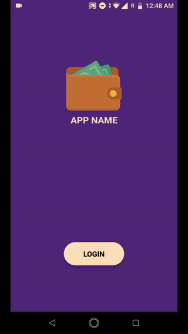

# React Native Animated Login


This is a simple animated login component which is built on top of react native animated api. This uses native driver to acheive smooth animation with 60fps.





### Installation
`npm install --save react-native-animated-login`


### Example
import `react-native-animated-login` module into your component
```javascript
import LoginView from 'react-native-animated-login'
```

Inside your component render, use `react-native-animated-login` api to render view. 

```javascript
<LoginView 
    logo={require('/path/to/your/img.png')} 
    primaryColor="#512DA8"
    accentColor="#fff"
    FormComponent = {viewComponent}
    title="APP NAME"
    titleColor="#fff"
    submitText="LOGIN"
    submitTextColor="#000"
    submitButtonColor="#14ccad"
    onSubmit={ ()=>console.log('submitted') }
/>
```
    

### Props 

 **Props** | **Type** | **Required** | **Description**
--- | --- | --- | ---
logo | PropTypes.node | false | Icon or image to be rendered
primaryColor | PropTypes.string | false | Primary color of the app
accentColor | PropTypes.string | false | Secondary color of the app
title | PropTypes.string | false | App name to be rendered
titleColor | PropTypes.string | false | Color of the title text
FormComponent | PropTypes.element | true | Form component to be render after animation
submitText | PropTypes.string | false | Text in the submit button
submitTextColor | PropTypes.string | false | Color of the text in submit button
submitButtonColor | PropTypes.string | false | Background color of submit button
onSubmit | PropTypes.func | true | callback function on submit

### Contribution
Issues are welcome. Please add a screenshot of bug and code snippet.
